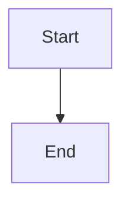

# 示例子系统

从本仓库代码抽取。仅当 `status: accepted` 时视为生效业务知识。

## 职责与边界

- **做**：…
- **不做**：…

## 领域概念

| 术语 | 含义 |
|------|------|
| … | … |

## 主流程

1. …
2. …

## 失败与边界

- …

## 关键接口 / 表 / 消息

| 类型 | 名称 | 说明 |
|------|------|------|
| API / 表 / MQ | … | … |

## 坑点与注意事项

- …
